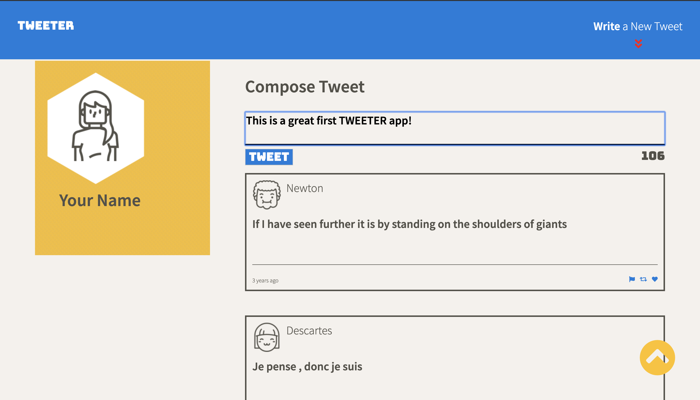
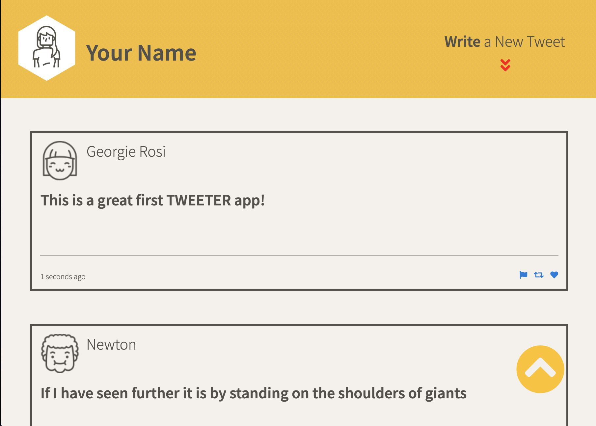
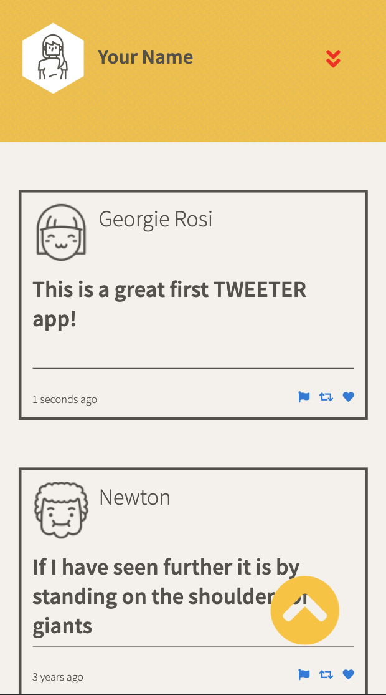

# Tweeter Project

Tweeter is a simple, single-page Twitter clone.

This repository is the starter code for the project: Students will fork and clone this repository, then build upon it to practice their HTML, CSS, JS, jQuery and AJAX front-end skills, and their Node, Express and MongoDB back-end skills.

## Final Product

## Purpose

**_BEWARE:_ This project was published for learning purposes. It is _not_ intended for use in production-grade software.**

This project was created and published by me as part of my learnings at Lighthouse Labs. 

## Key Features

* User name and avator are central on the main page
* Users can view a list of tweets in tbe main browser window
* By clicking the double down arrow buttons in the Nav or Header, an area for new tweets to be composed slides into view
  * While entering a tweet into the text area, the number of remaining characters is continually updated
  * Once the user enters more than the allowed 140 characters, the counter turns red
  * If tries to submit an invalid tweet (no entery, or more than 140 characters, a warning is shown and the submission is ignored)
* When a user hovers over existing tweets, the tweet itself is highlighted and the tweet's composer handle is shown
* The page follows responsive design principles, and adjust when the screen size shrinks, with breakpoints for phones and tablets
  * In phone view, the "Write New Tweet" text disappers leaving just the double down arrow button
* A second button appears whenever the user scrolls the window, this will take them back to the top of the page and put a cursor into the new tweet box. The button then slides out of view

## Potential Future Additions

Over time, the following additinal features would improve the Tweeter app:
* Allow a user to Register and Sign-in, and update a custom avatar
* Store tweets in a functional database so they can be stored over time
* Add functionality to the Like, Retweet, and Flag buttons on each tweet

## Getting Started

1. Fork this repository, then clone your fork of this repository.
2. Install dependencies using the `npm install` command.
3. Start the web server using the `npm run local` command. The app will be served at <http://localhost:8080/>.
4. Go to <http://localhost:8080/> in your browser.

## Dependencies

- Express
- BodyParser
- Chance
- md5
- Node 5.10.x or above

